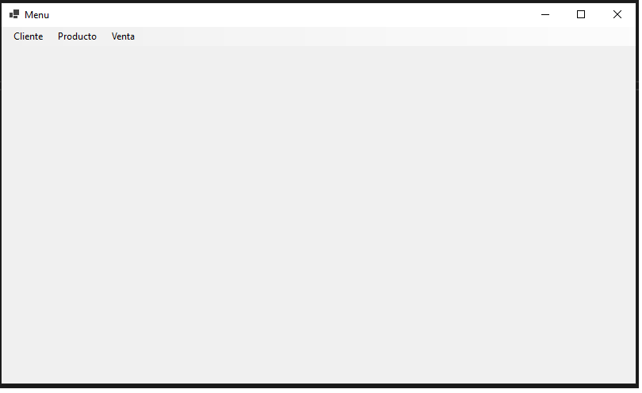
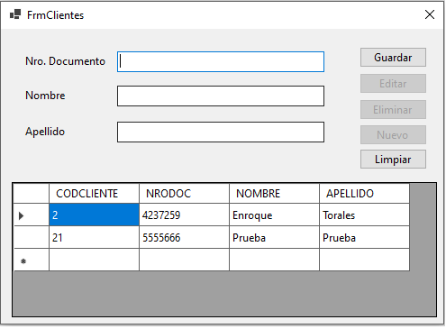
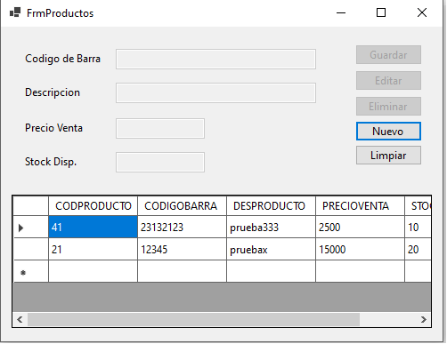
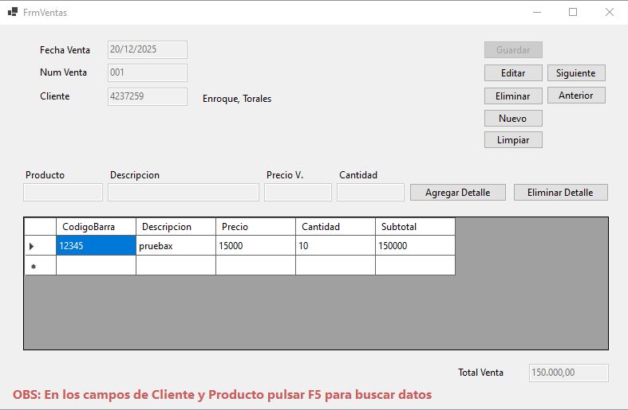
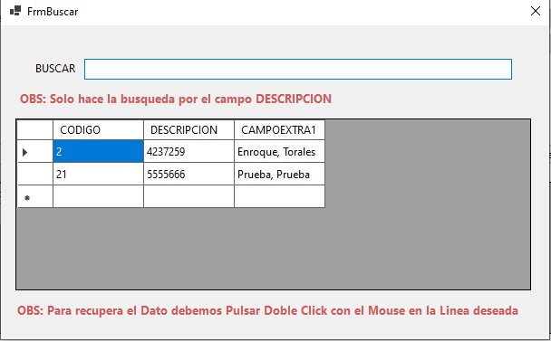

"# PRUEBA TÉCNICA BACKEND ABM" 

<h1>PRUEBA TÉCNICA BACKEND ABM</h1>
 
<h2>Desarrollar un sistema de ventas Aplicación en C# / .Net Core con WinForms</h2>
 
<ul>
    <li>
        ABM De productos (Cabecera)
        <ul>
            <li>Listar en una grilla</li>
        </ul>
    </li>
    <li>
        ABM De clientes (Cabecera)
        <ul>
            <li>Listar en una grilla</li>
        </ul>
    </li>
    <li>
        ABM de ventas (Cabecera Detalle)
        <ul>
            <li>Listar en una grilla</li>
        </ul>
    </li>
</ul>
 
<h2>REQUERIMIENTOS</h2>
<ul>
    <li>Comentar el Código en base de datos y Front explicando la razón de las validaciones</li>
    <li>Crear un ID único para cada ítem</li>
    <li>El campo de texto debe ser requerido y validado</li>
    <li>Subir el Código fuente a GITHUB con impresiones de pantalla</li>
    <li>La lógica y validaciones deben estar en la base de datos</li>
</ul>
 
<h2>IMAGENES<h2>

Inicio

  

Cliente

  

Producto

  

Ventas

  

Buscador

  

